# socialNetworkAPI

This is a backend application that utilizes mongoDB. MongoDb is a noSQL database that lets us use mongoose, similar to MySQL sequelize. Which allows us to create documents which we can then add, update, and delete data. In this project specifically it was, users, thoughts, reactions, and friends.

## Installation

* This application requires the use of [MongoDb](https://www.mongodb.com/) and [Mongoose](https://mongoosejs.com/)
* Clone the repository in github.
* Run an npm i.
* Then run the server with either node or nodemon.

## Usage 

User can create, update, delete and view, users, thoughts, reactions, and friends. 

### All users
* /api/users - GET
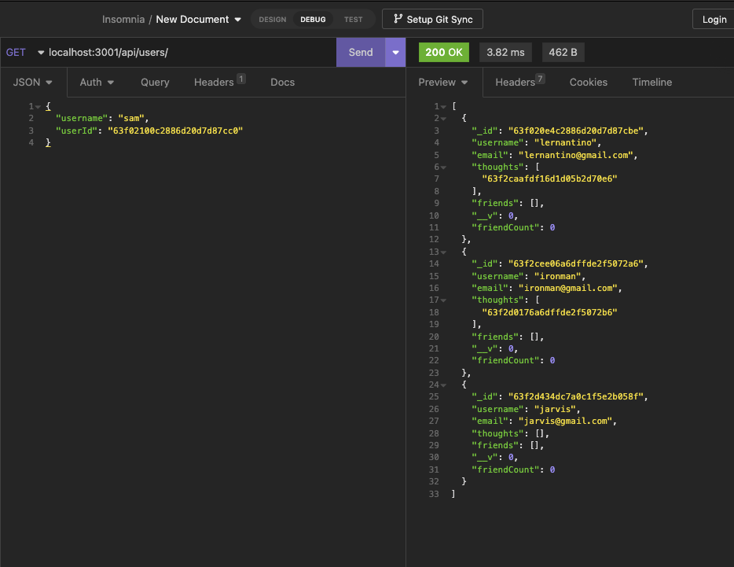

### Single user
* /api/:userId - GET 
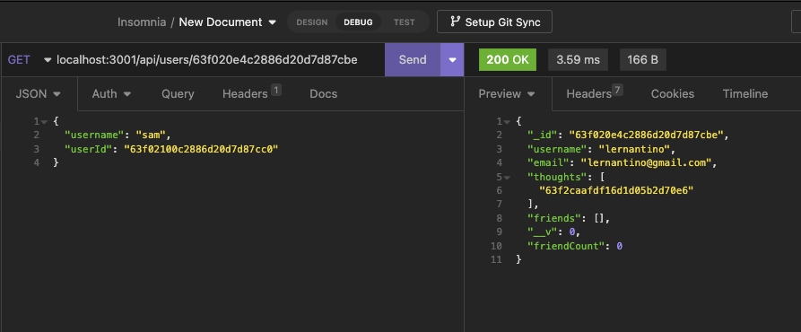

### Update user
* /api/:userId - PUT 
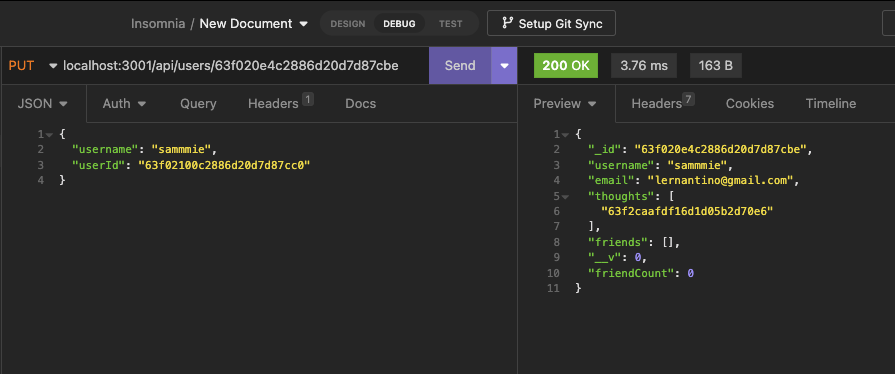
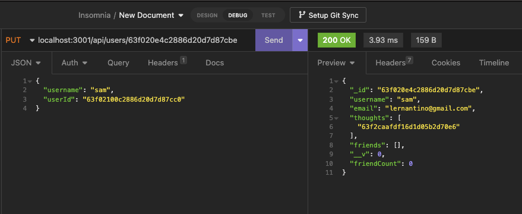

### All thoughts
* /api/thoughts - GET
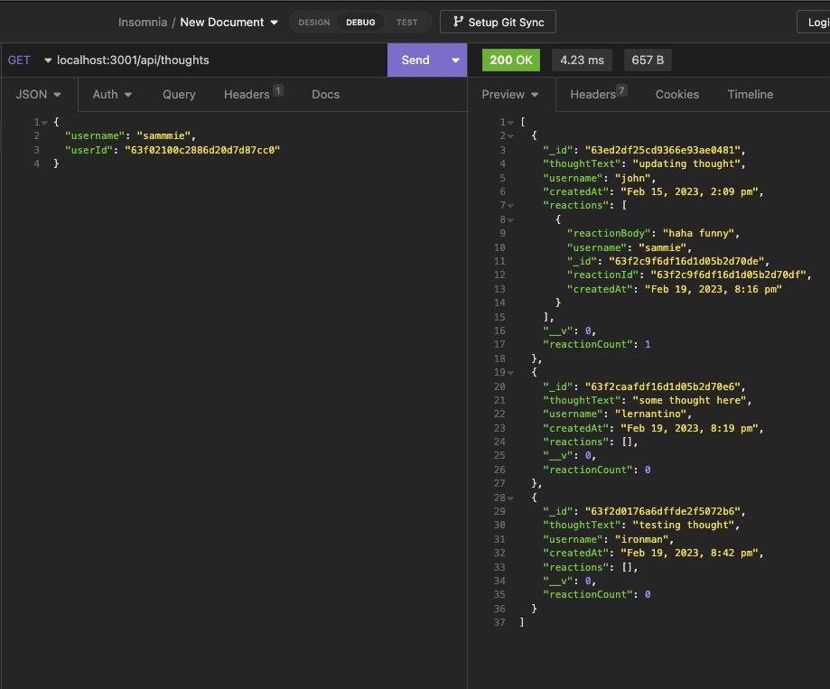

### Single thought
* /api/thoughts/:thoughtId - GET
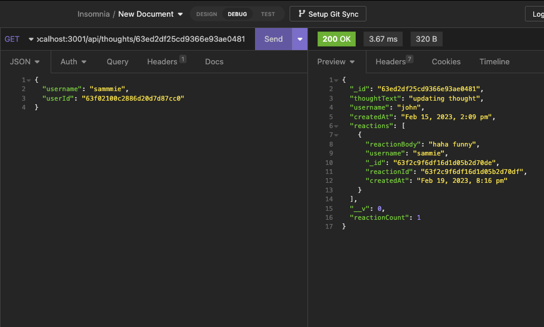

### Update thought
* /api/thought/:thoughtId - PUT 
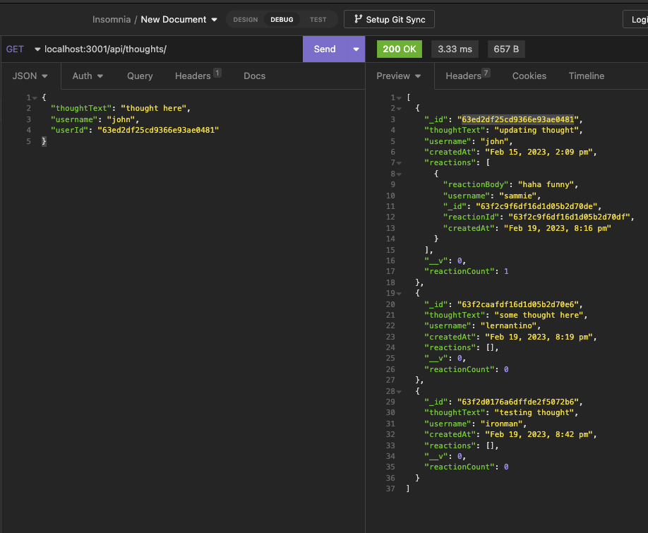
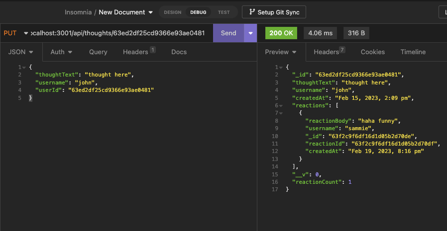

## Add reaction
* /api/thoughts/:thoughtId/reactions/ - POST
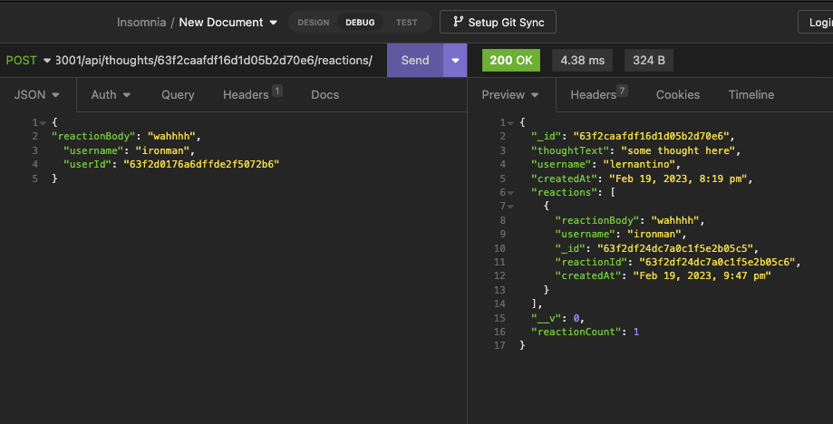

## Add friend
* /api/users/:userId/friends/:friendId - POST
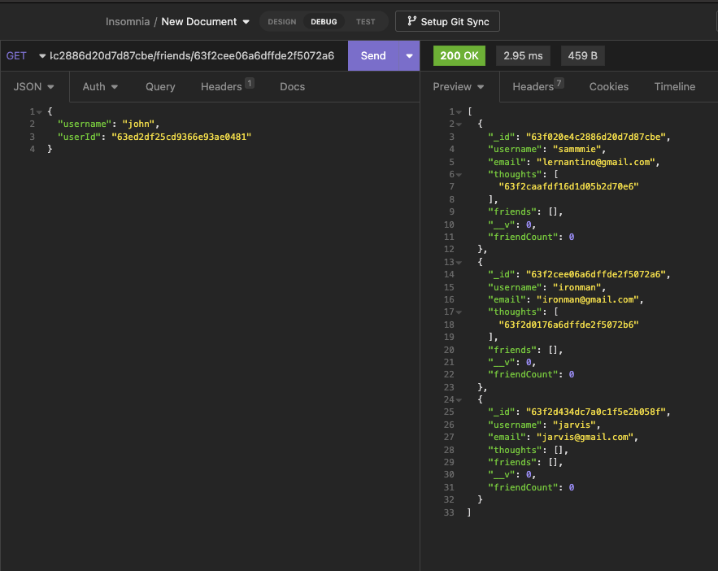
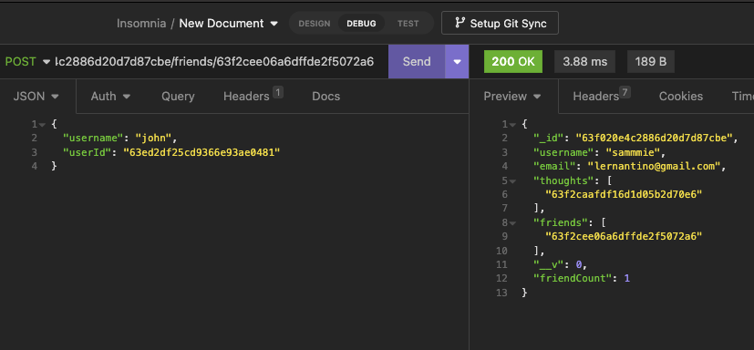

[Github](https://github.com/mintedd/socialNetworkAPI)

[Recording Part 1](https://drive.google.com/file/d/1P8DXoBVGDByLThF_IbCd-eWbxaH-pQHY/view)

[Recording Part 2](https://drive.google.com/file/d/1Cnp-fsirTBTmpkKAWgakTaTK_DNkrZdQ/view)